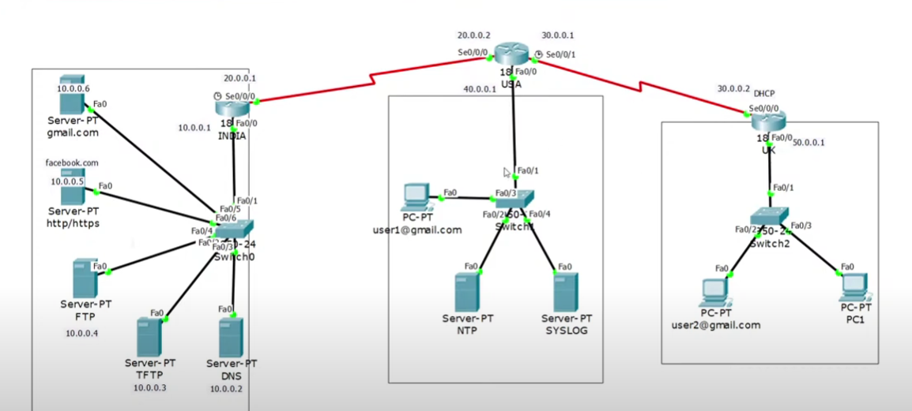

# WAN Design for Multiple Office Connectivity

## Overview

This project demonstrates the design and implementation of a Wide Area Network (WAN) to connect multiple office locations. The project is built using Cisco Packet Tracer, a powerful network simulation tool, and includes various network devices and servers to simulate a real-world network environment.

## Project Components

### 1. WAN Design
- The WAN design in this project is structured to provide reliable, secure, and efficient connectivity between different office locations.
- The design includes multiple layers of security and redundancy to ensure minimal downtime and protect against potential threats.
- The network is optimized for data transfer, communication, and resource sharing across offices.

### 2. Servers Used

- **FTP Server & TFTP Server**: For file transfers and backup purposes.
- **NTP Server (Time Server)**: To synchronize time across all network devices.
- **Syslog Server (Log Server)**: For centralized logging and monitoring of network activities.
- **Telnet & SSH**: For remote management and configuration of network devices.
- **HTTP/HTTPS**: For web services and secure communications.
- **SMTP & POP3 (Mail Server)**: For sending and receiving emails within the network.
- **DNS Server**: For resolving domain names to IP addresses.
- **DHCP Server**: For dynamic allocation of IP addresses to devices within the network.

### 3. Devices Used

- **Routers**: Core components of the WAN, responsible for directing traffic between office locations.
- **Switches**: Used for local area network (LAN) connectivity within each office.
- **Cables**: Physical connections between devices, simulating real-world cabling.
- **Servers**: Various servers providing essential network services.
- **PCs**: Client devices used by end-users to access network resources.
- **Laptops**: Mobile client devices with access to the network.

### 4. Platform

- The project is developed using **Cisco Packet Tracer**, a comprehensive network simulation tool that allows for the design, configuration, and testing of network scenarios.

## Project Goals

- **Scalability**: The WAN design is built to support future growth, allowing additional offices to be connected with minimal changes to the network infrastructure.
- **Security**: Implementing secure communication protocols like SSH and HTTPS to protect data and remote management sessions.
- **Reliability**: Ensuring continuous operation through redundant paths and devices, reducing the impact of any single point of failure.
- **Efficiency**: Optimizing network performance to ensure fast and reliable communication between offices.

## Installation and Usage

1. **Download Cisco Packet Tracer**: Ensure you have Cisco Packet Tracer installed on your machine.
2. **Open the Project File**: Load the `.pkt` file provided in the repository.
3. **Simulate the Network**: Use Cisco Packet Tracer's simulation mode to test and analyze network performance, routing, and communication between offices.
4. **Modify and Expand**: Customize the network design as needed to fit specific requirements or to simulate different scenarios.

## Conclusion

This WAN design project provides a comprehensive solution for connecting multiple offices, focusing on security, reliability, and efficiency. By leveraging Cisco Packet Tracer, the project offers a detailed simulation that can be used for educational purposes, network planning, and analysis.

## Future Enhancements

- **Integration with Cloud Services**: Exploring hybrid WAN solutions with cloud connectivity.
- **Advanced Security Features**: Implementing VPNs, firewalls, and intrusion detection systems.
- **Automation**: Utilizing network automation tools to streamline configuration and management.

---

This project serves as a foundation for understanding WAN design principles and can be adapted to various real-world networking scenarios. Feel free to modify and expand the design to suit your needs.
